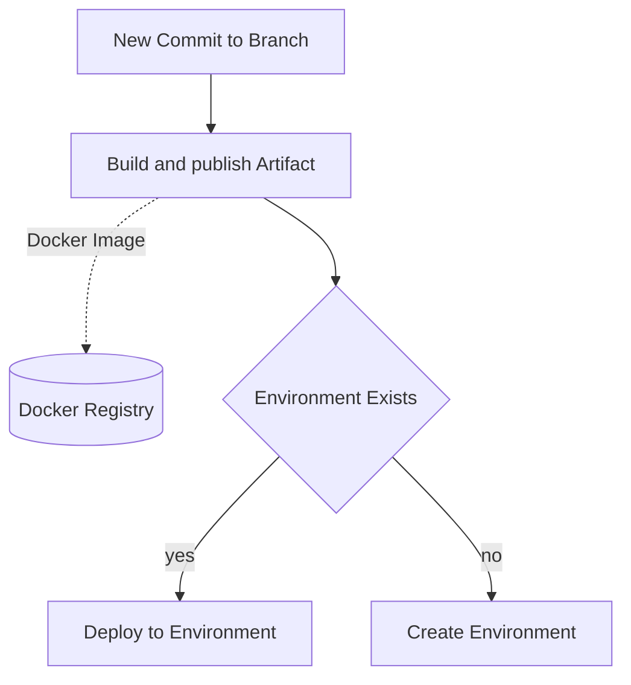

# warpd

## Process overview



### Env mapping configuration
```yaml
# warpd.yaml
# build:
#   - path: .
#     name: app
#     buildpack: XXX
#     builder: gcr.io/buildpacks/builder:v1
# envMapping:
#   - branch: <regex>
#     cluster: <Kubernetes cluster name>
#     envName: <regexWithGroups>
#     excludeBranches: [<branches to exclude, regex>]
build:
  - path: *
    name: foo
    buildpacks:
      - foo

envMapping:
  - branch: *
    excludeBranches:
      - main
      - staging
    envName: test-\(1\)
    cluster: test-us-east-1-1
  - branch: main
    envName: production
    cluster: production-us-east-1-1
```

## Required Parameters
- Kubernetes Cluster
- Docker registries

## Deployer
- helm dep up
- helm install
