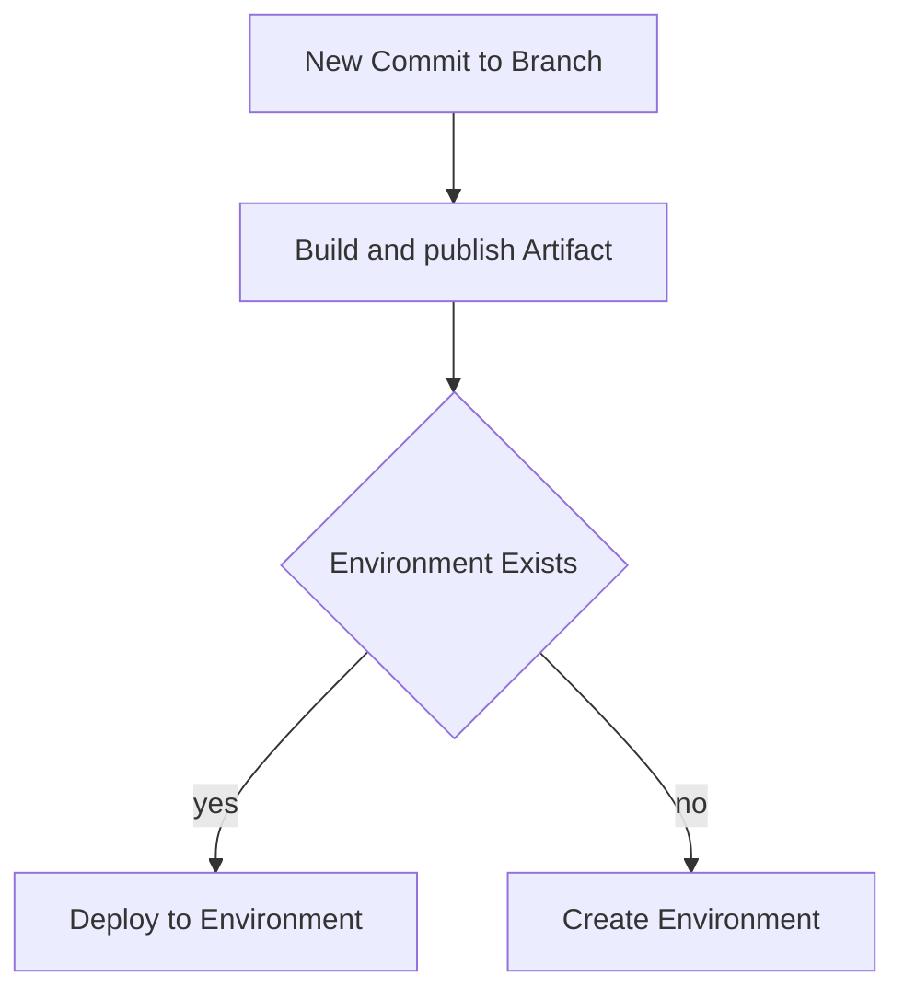

# warpd

## Process overview



### Env mapping configuration
```yaml
# warpd.yaml
#- branch: regex
#   cluster: name
#   envName: regexWithGroups
envMapping:
  - branch: *
    excludeBranches:
      - main
      - staging
    envName: test-\(1\)  
  - branch: main
    envName: production
```

## Deployer
- helm dep up
- helm install
